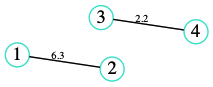
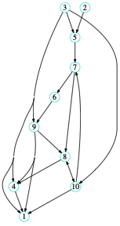
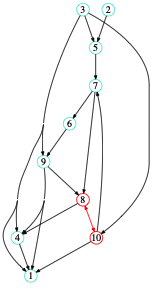
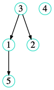
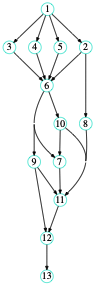
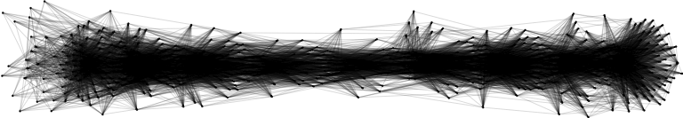
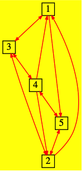

**Annotation**: Pkg.add("WeightedNetwork") will be available at version 1.0


```julia
using Pkg
Pkg.activate("../.")
using Revise
using WeightedNetwork

using Graphs, SimpleWeightedGraphs, SparseArrays
```

# WeightedNetwork

This package is build on `Graph.jl` and `SimpleWeightedGraphs.jl`. It just tailors these packages for my personal use.
Some algorithms are implemented by myself. There are not more efficient or better. Just to know how to implement them.

## How to use it:

### Generate random networks

#### Random undirected networks

Define a random undirected and weighted network $g$ with $n$ nodes and an edge density of $p$. Weights are in range from 1:10 per default.


```julia
n = 4
ρ= 0.3
g = WeightedNetwork.rand_network(n,ρ; weights=1:0.1:10); # weights are in range 1:m (m=1)
```

Plot the network. Here we use `Graphviz` and the great package `ShowGraphviz.jl`
 to render, if it is installed on your system:


```julia
WeightedNetwork.plot_graphviz(g;edge_label=true)
```




Using `Cairo.jl` and `Fontconfig.jl` to plot these graphs outside iJulia, or use `WeightedNetwork.network_plot(net)`, which is based `GraphPlot.jl`.

Define a random directed network with $n$ nodes and an edge density of $\rho$. The network ist weighted with randomly edge_weights between the range $R$:


```julia
n = 10
ρ = 0.2
R  = 1:0.1:10
net = WeightedNetwork.rand_directed_network(n,ρ;weights=R);
plot_graphviz(net;scale=3)
```


    

Unfortunatly, `Graphviz`has no option to rotate node-lables, too.

#### Network is type of `AbstractSimpleWeightedGraph.jl`


```julia
typeof(net)
```

    SimpleWeightedDiGraph{Int64, Float64}


So you can use **complete functionality** of `Graph.jl` and `SimpleWeightedGraphs.jl`.

```julia
@show Graphs.nv(net) # number of vertices
@show Graphs.ne(net); # number of edges
@show Graphs.has_self_loops(net);
```

    Graphs.nv(net) = 10
    Graphs.ne(net) = 19
    Graphs.has_self_loops(net) = false


Or calculate the shortest path with `Graphs.dijkstra_shortest_paths`. Or use a shortcut:


```julia
L = WeightedNetwork.shortest_path(net, 8,10); # oh! wrong result! Why?? Fix it
plot_graphviz(net;scale=3, path=L)
```



    

#### Generate a directed acyclic graphs (**DAG**):

Generate a random DAG with $n$ nodes and an edge density $\rho$. Attention: Graph does not have to be connected. PS: Another way to generate a DAG is to use `Graphs.jl` functions.


```julia
n = 5
ρ = 0.3
dag = WeightedNetwork.rand_dag(n,ρ);
@show Graphs.is_connected(dag)
WeightedNetwork.plot_graphviz(dag)
```

    Graphs.is_connected(dag) = false



    


For this we can get a topological_sort, so that all edges have same direction. **Note**: `Graphviz` sort the edges already in its render algorithm.


```julia
L,acyclic = WeightedNetwork.toplogicalsort(dag) # wrapper to Graphs.jl topoligical_sort method.
```


    ([5, 4, 2, 1, 3], true)


To get a layered and connected random DAG, use:


```julia
n = 5
m = 4
dag = WeightedNetwork.mk_connected_layered_dag(n,m);
```


```julia
plot_graphviz(dag)
```



    

```julia
@show Graphs.is_connected(dag)
@show Graphs.is_cyclic(dag);
```

    Graphs.is_connected(dag) = true
    Graphs.is_cyclic(dag) = false


#### Import *dot*-files:

There are differnt packages available to import `dot`-files (`GraphIO.jl`, ...). Here we use a simple *import* function from `WeightedNetworks.jl`:


```julia
dag_imported = WeightedNetwork.read_dot_file("../test/examples/large_dag.dot");
```

`Graphviz` is not the perfect engine to plot large graphs. A more suitable engine will be implemented soon. But for now some predefined attributes helps.


```julia
WeightedNetwork.plot_graphviz(dag_imported;scale=8.)
```



    

#### Manipulate `Graphviz` plot attributes

More informations about `GraphViz` attributes [https://graphviz.org](https://graphviz.org)

```julia
g = rand_directed_network(5,0.7;weights=1:0.1:10);
```

Attributes describes all possible preferences for printing graphs with `graphviz`. To get predefined attributes, use `default_attributes(g::AbstractSimpleWeightedGraph)`:


```julia
attr=default_attributes(g)
```


    Dict{Symbol, Vector{String}} with 15 entries:
      :width       => ["N", "0.25"]
      :largenet    => ["P", "200"]
      :fixedsize   => ["N", "true"]
      :shape       => ["N", "circle"]
      :overlap     => ["G", "scale"]
      :height      => ["N", "0.25"]
      :size        => ["G", "3.0"]
      :layout      => ["G", "dot"]
      :center      => ["G", "1"]
      :arrowsize   => ["E", "0.5"]
      :color       => ["N", "Turquoise"]
      :weights     => ["P", "false"]
      :fontsize    => ["E", "1.0"]
      :arrowtype   => ["E", "normal"]
      :concentrate => ["G", "true"]

Now, you can manipulate the attributes:

```julia
attr[:color] = ["E", "red"]; # to get blue edges, "E" stands for Edge-Attribute
attr[:shape] = ["N", "box"];  # to get boxes instead of circles
attr[:bgcolor] = ["G", "yellow"] # or set a new attribute and make a yellow background.
WeightedNetwork.plot_graphviz(g, attr)
```



    

### Use `Graph.jl` algorithm

Nearly all functions of `Graph.jl` can be used. So have a look on its documentation!

## Own Implementations


```julia
using BenchmarkTools
```


```julia
net = WeightedNetwork.rand_dag(200,0.01);
```


```julia
@btime L1 = WeightedNetwork.toplogicalsort(net; method="kahn");
```

      88.250 μs (1449 allocations: 113.31 KiB)


```julia
@btime L2 = WeightedNetwork.toplogicalsort(net; method="dfs");
```

      82.666 μs (643 allocations: 54.20 KiB)


```julia
@btime L3 = WeightedNetwork.toplogicalsort(net; method="graphs"); # default (`Graphs.jl` method)
```

      10.250 μs (309 allocations: 28.98 KiB)


O.k., `Graphs.jl` `topological_sort` is still much faster. 


```julia

```


```julia

```

to be continued ...

